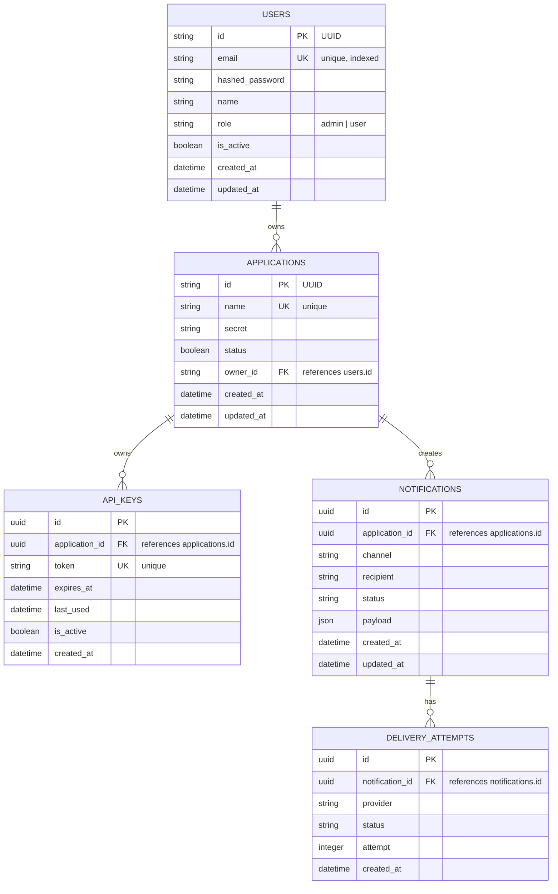

# Entity Relationship Diagram

```mermaid
erDiagram

USERS ||--o{ APPLICATIONS : owns
APPLICATIONS ||--o{ API_KEYS : owns
APPLICATIONS ||--o{ NOTIFICATIONS : creates
NOTIFICATIONS ||--o{ DELIVERY_ATTEMPTS : has

USERS{
    string id PK "UUID"
    string email UK "unique, indexed"
    string hashed_password
    string name
    string role "admin | user"
    boolean is_active
    datetime created_at
    datetime updated_at
}

APPLICATIONS{
    string id PK "UUID"
    string name UK "unique"
    string secret
    boolean status
    string owner_id FK "references users.id"
    datetime created_at
    datetime updated_at
}

API_KEYS{
    uuid id PK
    uuid application_id FK "references applications.id"
    string token UK "unique"
    datetime expires_at
    datetime last_used
    boolean is_active
    datetime created_at
}

NOTIFICATIONS{
    uuid id PK
    uuid application_id FK "references applications.id"
    string channel
    string recipient
    string status
    json payload
    datetime created_at
    datetime updated_at
}

DELIVERY_ATTEMPTS{
    uuid id PK
    uuid notification_id FK "references notifications.id"
    string provider
    string status
    integer attempt
    datetime created_at
}
```
